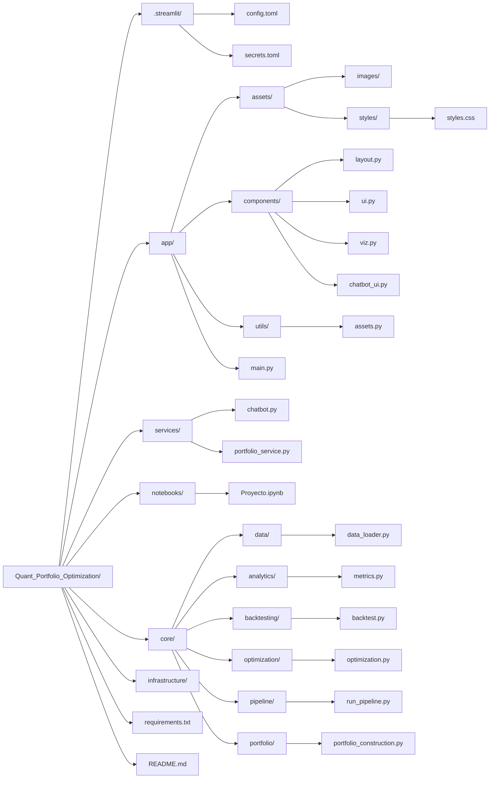

# Quant Portfolio Optimization
**Author:** 
- José Armando Melchor Soto

---

## Table of Contents


---
## Overview

A quantitative finance dashboard designed to build, optimize, and analyze investment portfolios using advanced allocation strategies such as Minimum Variance, Maximum Sharpe, Semi-Variance, and Omega optimization.

The platform enables users to simulate portfolio performance through dynamic backtesting, compare strategies against benchmarks, and evaluate risk using key financial metrics including volatility, Sharpe ratio, drawdown, and downside risk.

With flexible inputs for asset selection, rebalancing frequency, and capital allocation, the system provides a realistic environment for portfolio construction and strategy testing. Users can interactively explore performance evolution, correlation structures, asset allocation, and portfolio composition, gaining deeper insights into diversification and risk exposure.

Additionally, the dashboard bridges theory and practice by translating optimal portfolio weights into actionable investment decisions, including capital distribution and the exact number of shares to buy.

- 🚧 The project is currently evolving towards an AI-powered interface, where a built-in chatbot will allow users to interact with the system using natural language — enabling actions such as selecting optimization strategies, adjusting parameters, and triggering portfolio recomputations dynamically.

---

## Architecture

### Project Structure



---
### Functional Architecture

---

### OOP Architecture

---

## Installation

```bash
# 1. Clone the repository
git clone https://github.com/ppmelch/Credit_Scoring_Model.git
cd Credit_Scoring_Model

# 2. Create and activate a virtual environment
python -m venv .venv
source .venv/bin/activate      # macOS / Linux
.venv\Scripts\activate         # Windows

# 3. Install dependencies
pip install -r requirements.txt
```


